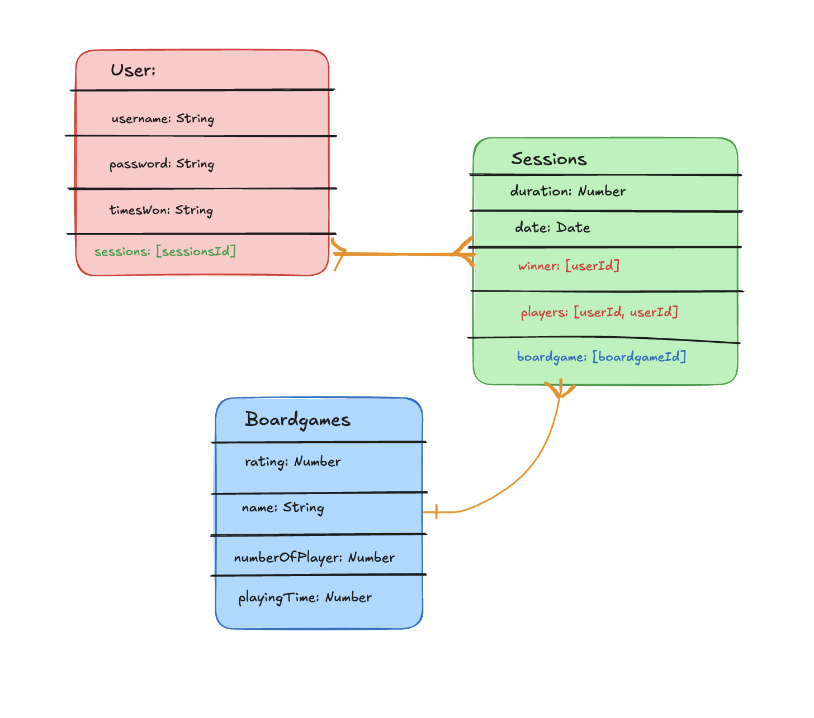
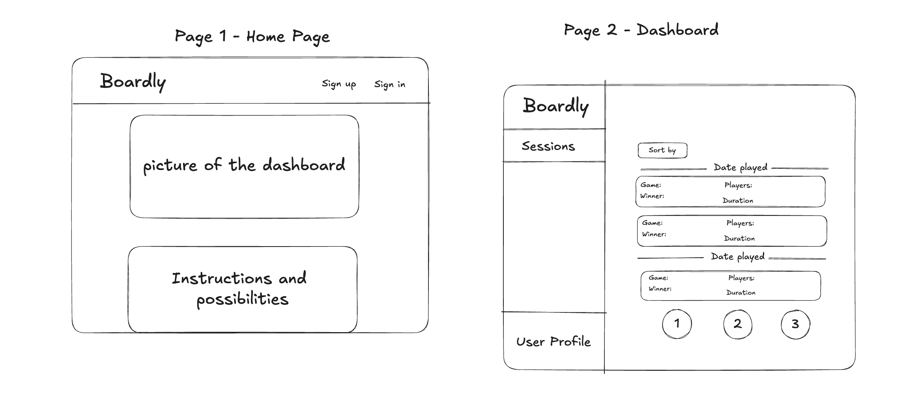
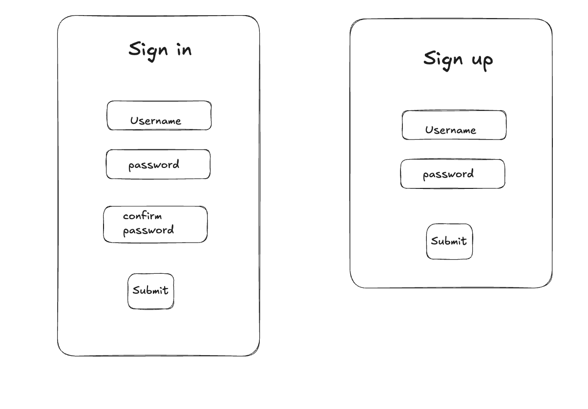

# Boardly - Project

## Description

Boardly is a companion app for board game enthusiasts. Log your plays, record winners, track stats, and relive your best game nights, all in one sleek app. Your entire board gaming history, beautifully organized in one place.

It helps you keep track of your game nights, from who played and who won, to which game was on the table, how long the session lasted, and when it took place. Whether you’re a casual player or a competitive strategist, Boardly makes it easy to record, relive, and analyze your board gaming moments.

## Project structure

**Models:** 
* UsersModel
* BoardgamesModel
* SessionsModel

**Views:**
* Index
* SignIn
* SignUp
* Dashboard
* Statistics
* User

**Controllers:**
* Authenticatnion 
* Statistics
* User

## Technologies

HTML, CSS, JS

## Schemas

## Pages

The home page leads to sing in/up forms. After signing in, user is shown the main dashboard.

