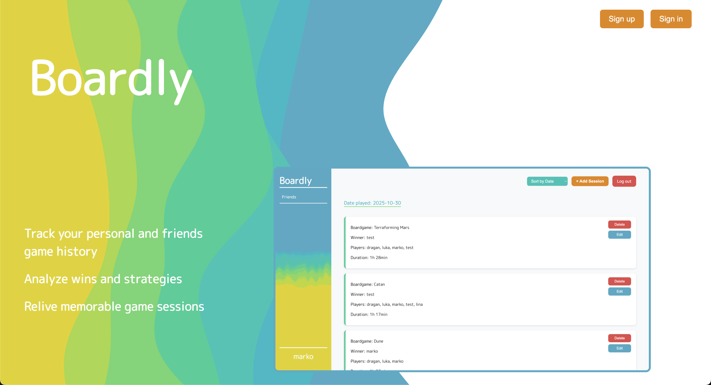
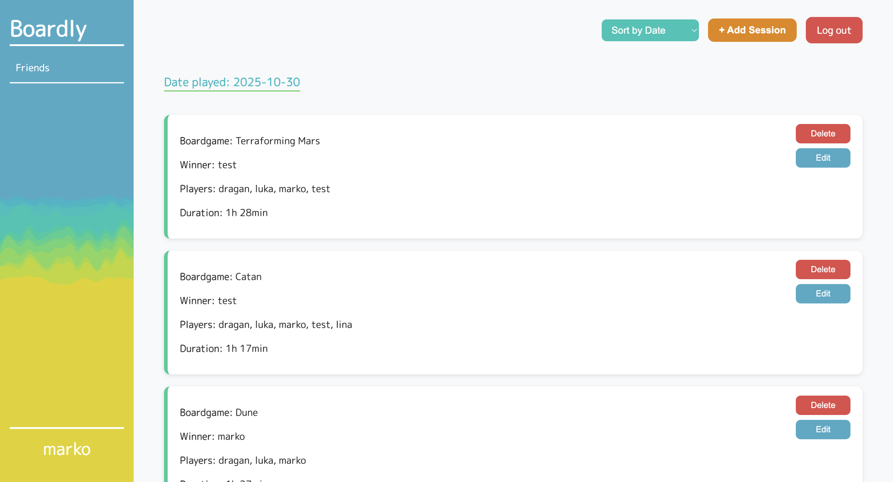

# Boardly 

## Description

Boardly is a companion app for board game enthusiasts. Log your plays, record winners, track stats, and relive your best game nights, all in one sleek app. Your entire board gaming history, beautifully organized in one place.

It helps you keep track of your game nights, from who played and who won, to which game was on the table, how long the session lasted, and when it took place. Whether you’re a casual player or a competitive strategist, Boardly makes it easy to record, relive, and analyze your board gaming moments.

[Click me to open](https://boardly-7263b4b6d90e.herokuapp.com/)

## Technologies

HTML, CSS, JS

## Pages

Home page:

Dashboard:

## Next Steps

### 1. Profile Page
- View user statistics, e.g.:
  - Winning rate per game
  - Total number of sessions played

### 2. Friends Feature
- Display list of friends
- View friends' profiles

### 3. Dashboard Styling
- Improve overall look and feel of the dashboard

### 4. Seasons Feature
- Create a season with friends
- Set win conditions for the season
- Track stats for each player:
  - Number of wins
  - Number of sessions played

### 5. Boardgames Database
- Add a selection of boardgames with basic information

### 6. Responsive design
- Add a responsive design for smaller screens